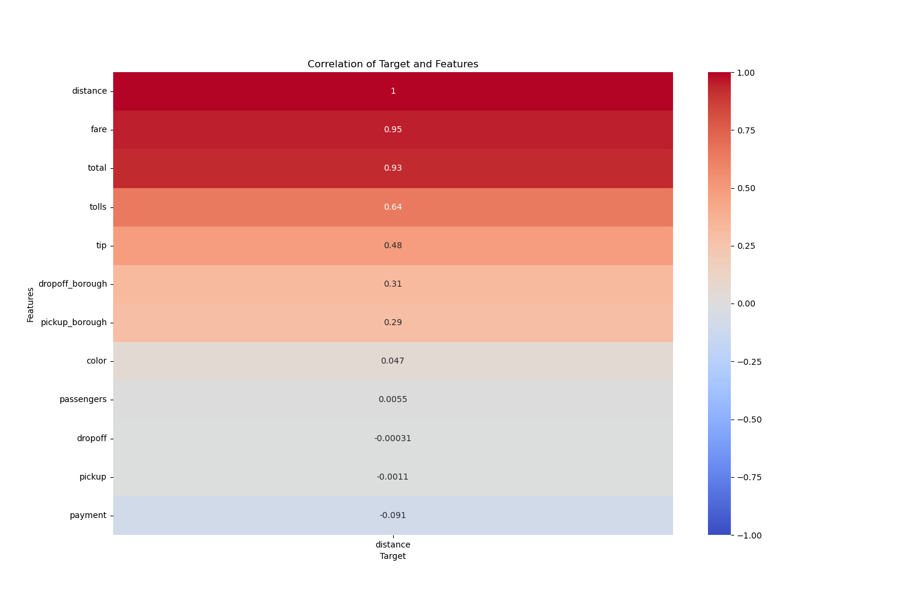
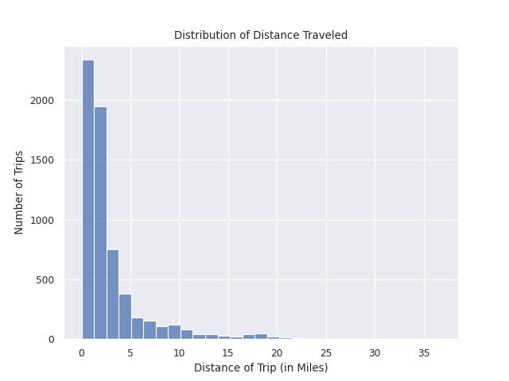
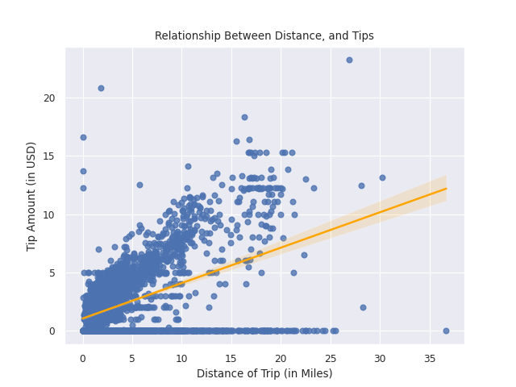
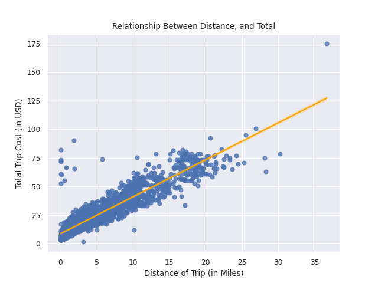

# Taxi Ride, Distance Analysis
## Project Purpose
The purpose of this project is to develop a model which can predict the distance you would make with a taxi ride, based on how much you would pay. This could be used as a model on an app, which could offer users a clear way understand how far they could go with the amount of money that they have.
## Data Dictionary
| Column name            |Description|
|-------------------|----------|
|pickup	       | The date and time the trip started.|
|dropoff	       | The date and time the trip ended.|
|passengers	   | The number of passengers for the trip.|
|distance	  |  The distance of the trip in miles.|
|fare	       | The initial fare calculated by the meter.|
|tip	          |  The tip amount paid.|
|tolls	       | The total amount of tolls paid.|
|total	       | The total cost of the trip, including fare, tip, and tolls.|
|color	       | The color of the taxi, either 'yellow' or 'green'.|
|payment	       | The method of payment, such as 'credit card' or 'cash'.|
|pickup_zone	 |   The name of the taxi zone for the pickup location.|
|dropoff_zone	|The name of the taxi zone for the drop-off location.|
|pickup_borough|	The name of the borough for the pickup location.|
|dropoff_borough|	The name of the borough for the drop-off location.|
## Summary
### Handling NaN Values and Outliers
- I handled NaN values by...
1. dropping them, I didn't want synthetic data to manipulate the performance of my model
**EX:**
```python
#dropping all the na values and saving them in a variable
sub = df.dropna()
```
- Then I had to handle object values, which I did two ways:
1. Using `.replace()`
```python
borough_val = ['Manhattan', 'Queens', 'Brooklyn', 'Bronx', 'Staten Island']
borough_dum = [1, 2, 3, 4, 5]
# assigned to variables, one with the actual values...
# one with what I wanted to replace those values with

sub['pickup_borough'] = sub['pickup_borough'].replace(to_replace= borough_val, value= borough_dum)
sub['dropoff_borough'] = sub['dropoff_borough'].replace(to_replace= borough_val, value= borough_dum)
# used the to replace parameter as I wanted to change those.
# used the value parameter, which was the values I wanted from the method
# saved changes that I made to those column
```
2. using `pd.Categorical()`
```python
sub['color'] = pd.Categorical(sub['color'], categories = ['yellow', 'green'], ordered = True)
sub['payment'] = pd.Categorical(sub['payment'], categories= ['credit card', 'cash'], ordered = True)
# changes the string value types to categorical ones by using pd.Categorical

sub['color'] = sub['color'].cat.codes
sub['payment'] = sub['payment'].cat.codes
# used .cat.codes to change the categorical data types to numerical ones
# saved changes that I made to those column
```
- Lastly, I decided to drop two columns, as I felt they would've been to confusing for an application
```python
sub_2 = sub.drop(columns = ['pickup_zone','dropoff_zone'], axis = 1)
# dropped these columns, cause using them for a flask app would be confusing
```
- after all of that, I saved the changes by pickling the dataset, and read in the clean data
```python
sub_2.to_pickle('data/cleaned_taxis_dataset')
# pickled the dataset as I wanted to keep the datetime objects as is (in case they were useful)

data = pd.read_pickle('data/cleaned_taxis_dataset')
```
## EDA
### key visuals
#### 1. A heatmap of Correlations of 

**a heatmap which shows the correlations between different numerical columns, this was helpful when it came to selecting features in order to create the model**
#### 2. A Histogram of The Distance
 
**a histogram that shows the distribution of the Distance target variable. Shows us that the average distance for most taxi rides is around 1 mile, which is quite short**
#### 3. A Regressionplot of Distance and Tips
 
**A Regressionplot that shows the relationship between the Distance of a taxi trip and the amount the rider tipped. They have a slighty positive relationship. The most interesting thing about this visualization though is that it shows us the difference in how people tip. Peopl appear to be either really generous, or not at all**
#### 4. A Regressionplot of Distance and the Total Cost
 
**A Regressionplot which shows us the distance of a taxi trip by the total the rider spent for the taxi trip. Very Important as it shows us a feature which correlates strongly with the Target Variable, which can be a great tool later on**
## Model Performance
### Feature Selection
**I decided to chose these features...**
1. fare
2. tip
3. tolls
4. total
I chose them as,of the available features, they had te best correlations with the target variable `distance`
### Model Selection
**I chose several models...**
1. Linear Regression
2. Decission Tree Regressor
3. Random Forest Regressor
4. K Nearest Neighbors Regressor
5. Lasso

**chose these because i'm used to using them**
### Evaluation Metric

| Model             |    R²   | 
|-------------------|----------|
| Linear Regressor |88.447 %|
|Decission Tree Regressor|87.336 % |
|Random Forest Regressor|88.229 %|
|K Nearest Neighbor Regressor|88.959 %|
|Lasso | 87.557 % |
### pickling
I chose to pickle the K Nearest Neighbor Regressor, as it had the best R squared score, I was also interested in utilizing a pipline to create the app, in order to develop predictions as that is something that i had learned about and liked
## conclusion
#### my analysis was able to create a model that is effecctive at developing predictions, it could be used to...
- give predictions to individuals using an app, to estimate how far they could go with as little money as possible
- potentially be used with ride share apps to do a similar thing